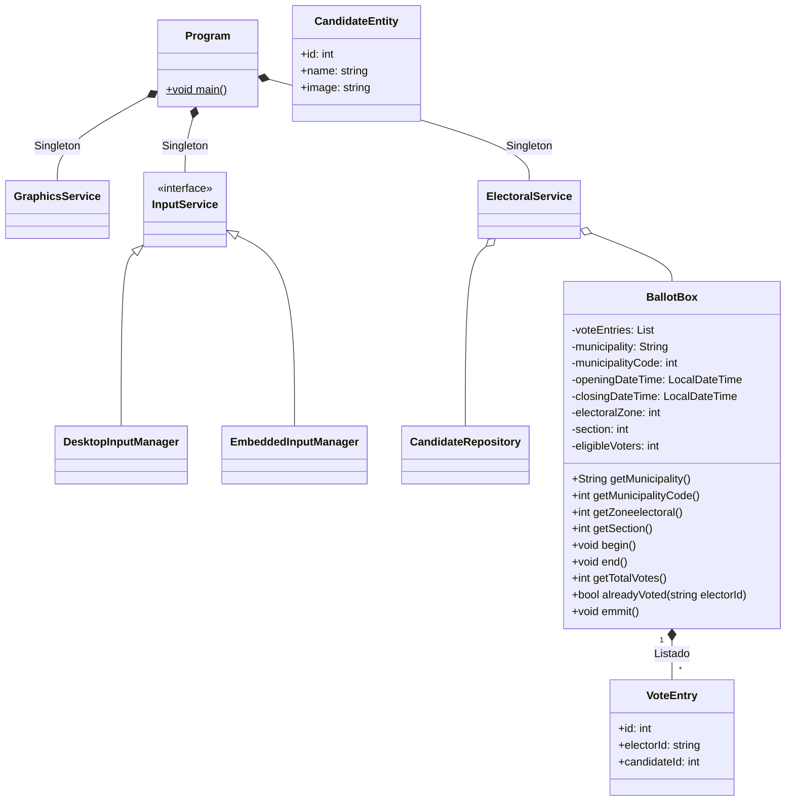

```mermaid
classDiagram

class Program {
    +void main()$
}

class GraphicsService {
    
}

class ElectoralService {

}

class InputService <<interface>> {

}

class DesktopInputManager {

}

class EmbeddedInputManager {
    
}

class CandidateRepository {

}

class CandidateEntity {
    %% TODO ver com nirton o encapsulamento das
    %% entidades do DB no java
    +id: int
    +name: string
    +image: string
}

class VoteEntry {
    +id: int
    +electorId: string
    +candidateId: int
}

class BallotBox {
    %% municipality -> 5 digits
    %% UE -> 8 digits
    %% 

    -voteEntries: List<VoteEntry>
    -municipality: String
    -municipalityCode: int 
    -openingDateTime: LocalDateTime
    -closingDateTime: LocalDateTime
    -electoralZone: int
    -section: int
    -eligibleVoters: int
    
    +String getMunicipality()
    +int getMunicipalityCode()
    +int getZoneelectoral()
    +int getSection()

    +void begin()
    +void end()

    +int getTotalVotes()
    +bool alreadyVoted(string electorId)

    +void emmit()
}

Program *-- GraphicsService : Singleton
Program *-- ElectoralService : Singleton
Program *-- InputService : Singleton

ElectoralService o-- CandidateRepository
ElectoralService o-- BallotBox

InputService <|-- DesktopInputManager
InputService <|-- EmbeddedInputManager

BallotBox "1" *-- "*" VoteEntry : Listado 
```
